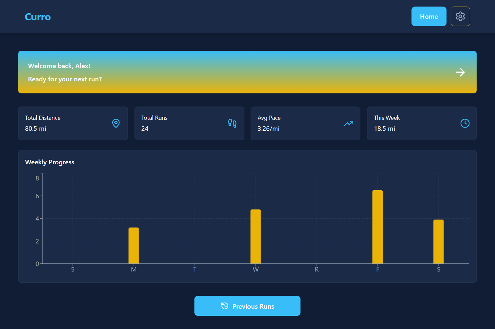
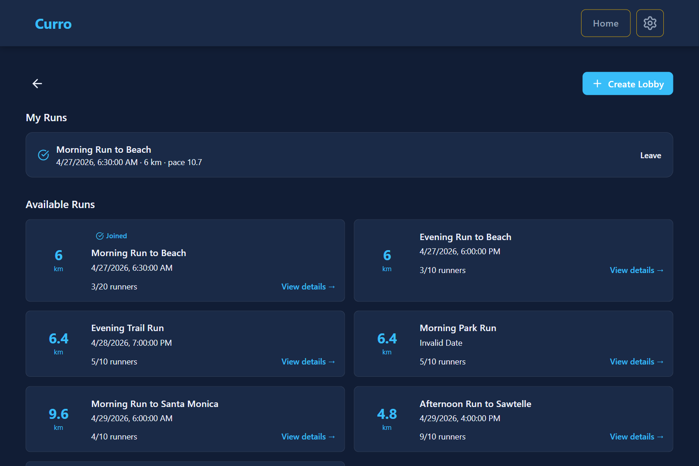
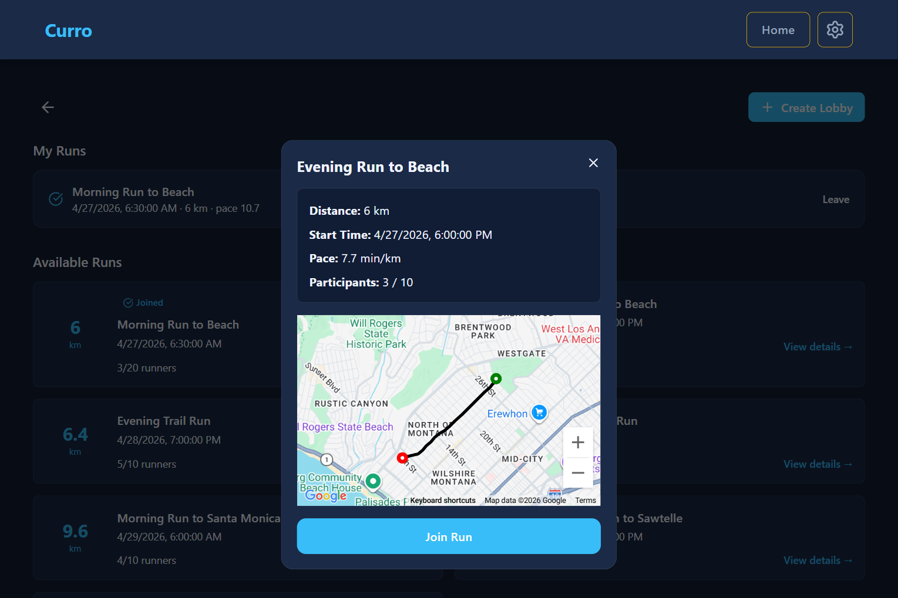

# Curro

Curro is an app for runners to connect with each other. 

## Features
At the heart of Curro is the run lobby: users anonymously join lobbies to meet other runners at set routes, allowing 
users to run with others where they want, when they want, and how far they want. They feature the following:
 * Lobbies are pre-generated or created by users with a set route, time, and pace.
 * Users are anonymous, allowing users to meet new people enthusiastic about running.
 * Users see lobbies based on their own preferences, matching their run distance and pace.

| Lobby | Lobby Configurations |
| :---: | :---: |
|  |  |

## Run Dev
RMK: Will not run without proper environment variables.
### Run Client
1.  Navigate to client: `cd client`
2.  Install packages:  `npm install`
3.  Run dev: `num run dev`
### Run Sever
1.  Navigate to client: `cd server`
2.  Install packages:  `npm install`
3.  Run dev: `node app.js`
